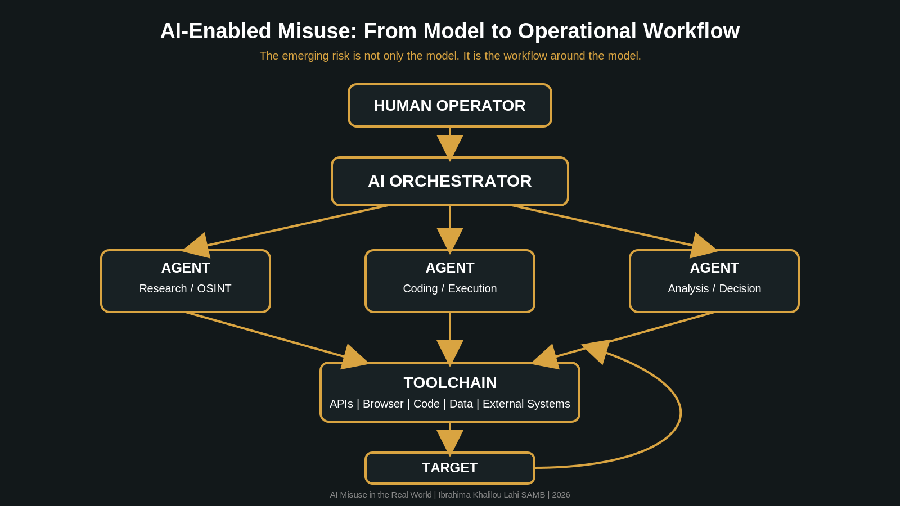

# AI Misuse in the Real World

> Understanding how AI is changing the economics, scale and operationalization of real-world misuse.

A community-oriented technical summary and reading guide based on Anthropic's *Detecting and Countering Misuse of AI: September 2026*.

## Why this repository?

AI is increasingly moving from being a simple assistant to becoming part of larger operational workflows.

This repository distills the key findings of Anthropic's September 2026 threat intelligence report into a practical guide for:

- Security Engineers
- AppSec practitioners
- Developers
- AI Security researchers
- Threat Intelligence teams
- Cybersecurity students

The goal is simple:

**Understand what is changing and what defenders should do about it.**

## Key Findings

### 01. AI is changing attack economics

AI reduces the cost and time required to perform complex operations while increasing scale and parallelism.

### 02. From assistant to orchestrator

The emerging threat is not only AI-generated content or code, but AI-enabled workflows that can plan, execute, observe and adapt.

### 03. The AI supply chain is now part of the attack surface

API keys, agents, sandboxes, credentials, proxies and model access can all become valuable targets.

### 04. Detect workflows, not only artifacts

Security teams increasingly need to correlate identity, behavior, tool usage, scale, persistence and target activity.

### 05. Defense in depth is mandatory

No single classifier or safeguard is sufficient against increasingly complex AI-enabled misuse.

## Contents

- `AI-Misuse-September-2026-Community-Summary.md`  
  The complete technical summary and reading guide.
- `AI-Misuse-September-2026-Community-Summary.pdf`  
  Shareable PDF edition.
- `references.md`  
  Source and case index.
- `assets/architecture.png`  
  Visual model of an AI-enabled operational workflow.
- `LICENSE`  
  Creative Commons Attribution 4.0 license for the original material.
- `CHANGELOG.md`  
  Project history.

## Source

**Anthropic, Detecting and Countering Misuse of AI: September 2026**

The source report covers malicious activity observed or disrupted by Anthropic Threat Intelligence from December 2025 through August 2026.

It organizes cases into seven broad harm areas:

1. Cyber operations
2. Influence operations
3. Surveillance operations
4. Conventional weapons
5. Biological misuse
6. Scams and fraud
7. Illicit distillation

## How to read this guide

The document distinguishes between:

- observations described by the Anthropic report
- independent technical interpretation
- practical defensive recommendations

It does not claim that the author participated in, investigated, or authored any of the underlying incidents.

## Visual model

## Author

**Ibrahima Khalilou Lahi SAMB**

Backend Engineer focused on Application Security and Secure Software  
Founder @PCYBOX

[LinkedIn](https://www.linkedin.com/in/ibrahima-samb-dev/)

## Disclaimer

This repository is an independent community summary and technical interpretation.

It is not affiliated with, sponsored by, or endorsed by Anthropic.

The original Anthropic report, trademarks, names, quotations and other third-party materials remain the property of their respective owners.

> Ibrahima Khalilou Lahi SAMB, *AI Misuse in the Real World: A community-oriented technical summary of Anthropic's Detecting and Countering Misuse of AI: September 2026.*

## Contributing

Suggestions, corrections, translations and improvements are welcome.

If you find an issue in the interpretation or want to contribute a defensive perspective, open an issue or submit a pull request.

## License

The original material in this repository is released under **CC BY 4.0**.

See [LICENSE](LICENSE) for details.
